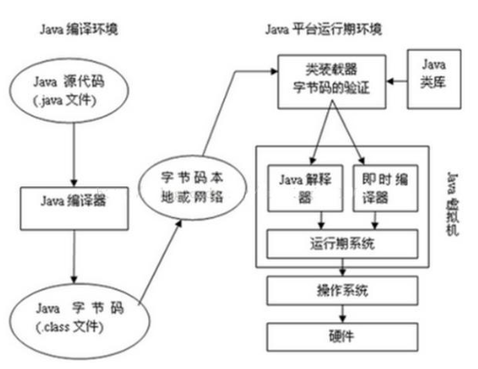
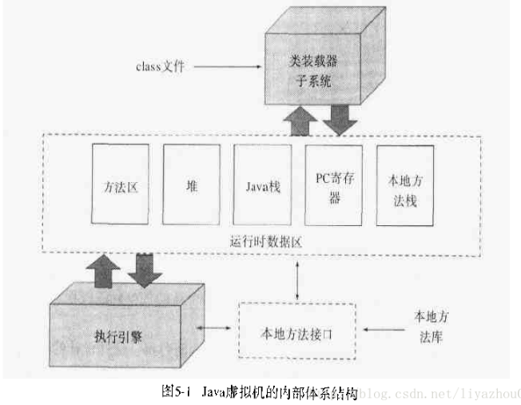
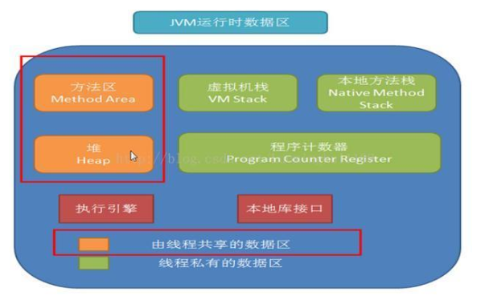
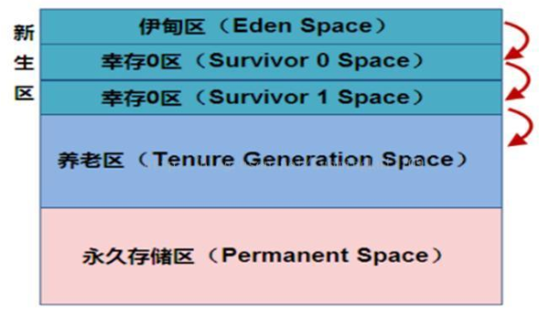

## JVM深入理解

#### 1.JVM简析

说起Java，我们首先想到的是Java编程语言，然而事实上，Java是一种技术，它由四方面组成：Java编程语言、Java类文件格式、Java虚拟机和Java应用程序接口(Java API)。它们的关系如下图所示：

#### 2.JVM基本概念

(1) 基本概念：

JVM是可运行Java代码的假想计算机 ，包括一套字节码指令集、一组寄存器、一个栈、一个垃圾回收，堆 和 一个存储方法域。JVM是运行在操作系统之上的，它与硬件没有直接的交互。

(2) 运行过程：

我们都知道Java源文件，通过编译器，能够生产相应的.Class文件，也就是字节码文件，而字节码文件又通过Java虚拟机中的解释器，编译成特定机器上的机器码 。

也就是如下：

① Java源文件—->编译器—->字节码文件

② 字节码文件—->JVM—->机器码

每一种平台的解释器是不同的，但是实现的虚拟机是相同的，这也就是Java为什么能够跨平台的原因了 ，当一个程序从开始运行，这时虚拟机就开始实例化了，多个程序启动就会存在多个虚拟机实例。程序退出或者关闭，则虚拟机实例消亡，多个虚拟机实例之间数据不能共享。

#### 3.JVM的体系结构

(1) Class Loader类加载器

负责加载 .class文件，class文件在文件开头有特定的文件标示，并且ClassLoader负责class文件的加载等，至于它是否可以运行，则由Execution Engine决定。

① 定位和导入二进制class文件

② 验证导入类的正确性

③ 为类分配初始化内存

④ 帮助解析符号引用.

(2) Native Interface本地接口:

本地接口的作用是融合不同的编程语言为Java所用，它的初衷是融合C/C++程序，Java诞生的时候C/C++横行的时候，要想立足，必须有调用C/C++程序，于是就在内存中专门开辟了一块区域处理标记为native的代码，它的具体作法是Native Method Stack中登记native方法，在Execution Engine执行时加载native libraies。

目前该方法使用的越来越少了，除非是与硬件有关的应用.

(3) Execution Engine 执行引擎：执行包在装载类的方法中的指令，也就是方法。

(4) Runtime data area 运行数据区:

虚拟机内存或者Jvm内存，冲整个计算机内存中开辟一块内存存储Jvm需要用到的对象，变量等，运行区数据有分很多小区，分别为：方法区，栈，本地方法栈，堆，程序计数器。

#### 4.JVM数据运行区详解（栈管运行，堆管存储）

说明：JVM调优主要就是优化 Heap堆 和 Method Area 方法区。

(1) Native Method Stack本地方法栈

它的具体做法是Native Method Stack中登记native方法，在Execution Engine执行时加载native libraies。

(2) PC Register程序计数器

每个线程都有一个程序计算器，就是一个指针，指向方法区中的方法字节码（下一个将要执行的指令代码），由执行引擎读取下一条指令，是一个非常小的内存空间，几乎可以忽略不记。

(3) Method Area方法区

方法区是被所有线程共享，所有字段和方法字节码，以及一些特殊方法如构造函数，接口代码也在此定义。简单说，所有定义的方法的信息都保存在该区域，此区域属于共享区间。

静态变量+常量+类信息+运行时常量池存在方法区中，实例变量存在堆内存中。

(4) Stack 栈

① 栈是什么

栈也叫栈内存，主管Java程序的运行，是在线程创建时创建，它的生命期是跟随线程的生命期，线程结束栈内存也就释放，对于栈来说不存在垃圾回收问题，只要线程一结束该栈就Over，生命周期和线程一致，是线程私有的。

基本类型的变量和对象的引用变量都是在函数的栈内存中分配。

② 栈存储什么？

栈帧中主要保存3类数据：

本地变量（Local Variables）：输入参数和输出参数以及方法内的变量；

栈操作（Operand Stack）：记录出栈、入栈的操作；

栈帧数据（Frame Data）：包括类文件、方法等等。

③ 栈运行原理

栈中的数据都是以栈帧（Stack Frame）的格式存在，栈帧是一个内存区块，是一个数据集，是一个有关方法和运行期数据的数据集，当一个方法A被调用时就产生了一个栈帧F1，并被压入到栈中，A方法又调用了B方法，于是产生栈帧F2也被压入栈，B方法又调用了C方法，于是产生栈帧F3也被压入栈…… 依次执行完毕后，先弹出后进......F3栈帧，再弹出F2栈帧，再弹出F1栈帧。

遵循“先进后出”/“后进先出”原则。

(5) Heap 堆

堆这块区域是JVM中最大的，应用的对象和数据都是存在这个区域，这块区域也是线程共享的，也是 gc 主要的回收区，一个 JVM 实例只存在一个堆类存，堆内存的大小是可以调节的。类加载器读取了类文件后，需要把类、方法、常变量放到堆内存中，以方便执行器执行，堆内存分为三部分：

① 新生区

新生区是类的诞生、成长、消亡的区域，一个类在这里产生，应用，最后被垃圾回收器收集，结束生命。新生区又分为两部分：伊甸区（Eden space）和幸存者区（Survivor pace），所有的类都是在伊甸区被new出来的。幸存区有两个：0区（Survivor 0 space）和1区（Survivor 1 space）。当伊甸园的空间用完时，程序又需要创建对象，JVM的垃圾回收器将对伊甸园进行垃圾回收（Minor GC）,将伊甸园中的剩余对象移动到幸存0区。若幸存0区也满了，再对该区进行垃圾回收，然后移动到1区。那如果1去也满了呢？再移动到养老区。若养老区也满了，那么这个时候将产生Major GC（FullGCC），进行养老区的内存清理。若养老区执行Full GC 之后发现依然无法进行对象的保存，就会产生OOM异常“OutOfMemoryError”。

如果出现java.lang.OutOfMemoryError: Java heap space异常，说明Java虚拟机的堆内存不够。原因有二：

a.Java虚拟机的堆内存设置不够，可以通过参数-Xms、-Xmx来调整。

b.代码中创建了大量大对象，并且长时间不能被垃圾收集器收集（存在被引用）。

② 养老区

养老区用于保存从新生区筛选出来的 JAVA 对象，一般池对象都在这个区域活跃。

③ 永久区

永久存储区是一个常驻内存区域，用于存放JDK自身所携带的 Class,Interface 的元数据，也就是说它存储的是运行环境必须的类信息，被装载进此区域的数据是不会被垃圾回收器回收掉的，关闭 JVM 才会释放此区域所占用的内存。

如果出现java.lang.OutOfMemoryError: PermGen space，说明是Java虚拟机对永久代Perm内存设置不够。原因有二：

a. 程序启动需要加载大量的第三方jar包。例如：在一个Tomcat下部署了太多的应用。

b. 大量动态反射生成的类不断被加载，最终导致Perm区被占满

