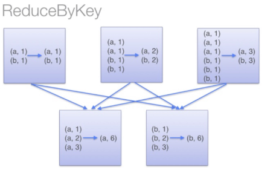
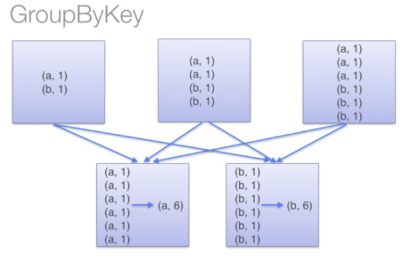

#### 1、

答：redeuceByKey:reduceByKey在结果发送至reducer之前会对每个mapper在本地进行merge,有点类似于在MapReduce中的combiner。这样做的好处在于，在map端进行一次reduce之后，数据量会大幅度减少，从而减少传输，保证reduce端能够更快的进行结果计算。

groupByKey:groupByKey会对每个RDD中的value值进行聚合形成一个序列(Iterator),此操作发生在reduce端，所以势必会造成所有的数据通过网络进行传输，造成不必要的浪费，同时数据量十分大的时候，还会造成oom（内存溢出）。

因此，大量数据的reduce操作时候建议使用reduceByKey，不仅可以提高速度，还可以防止使用groupByKey造成的内存溢出问题。

#### 2、final和finally的区别

final是修饰类或者变量，finally是在异常处理中使用.

final修饰的类不能被继承，修饰的变量就是一个常量，只能被赋值一次.

try{}catch(){}finall{},finally的作用一般用于必须处理的事情，如关闭连接等.

#### 3、cache\persisit\checkpoint的区别

1、cache()调用了persist(),区别在于cache只有一个默认的缓存级别MEMORY_ONLY，而persist可以根据情况设置其它的缓存级别，StorageLevel类中有12种缓存级别.

2、checkpoint的意思就是建立检查点,类似于快照,例如在spark计算里面 计算流程DAG特别长,服务器需要将整个DAG计算完成得出结果,但是如果在这很长的计算流程中突然中间算出的数据丢失了,spark又会根据RDD的依赖关系从头到尾计算一遍,这样子就很费性能,当然我们可以将中间的计算结果通过cache或者persist放到内存或者磁盘中,但是这样也不能保证数据完全不会丢失,存储的这个内存出问题了或者磁盘坏了,也会导致spark从头再根据RDD计算一遍,所以就有了checkpoint,其中checkpoint的作用就是将DAG中比较重要的中间数据做一个检查点将结果存储到一个高可用的地方(通常这个地方就是HDFS里面)

#### 4、简述mapreduce原理

[https://www.cnblogs.com/ywx-vashon/p/4895734.html]: 老版本

[https://blog.csdn.net/qq_34764487/article/details/78003101]: 新版本

#### 5、MR的shuffle过程

[https://blog.csdn.net/weixin_40652340/article/details/78547092]: 

#### 6、Jvm

#### 7、Jvm GC算法