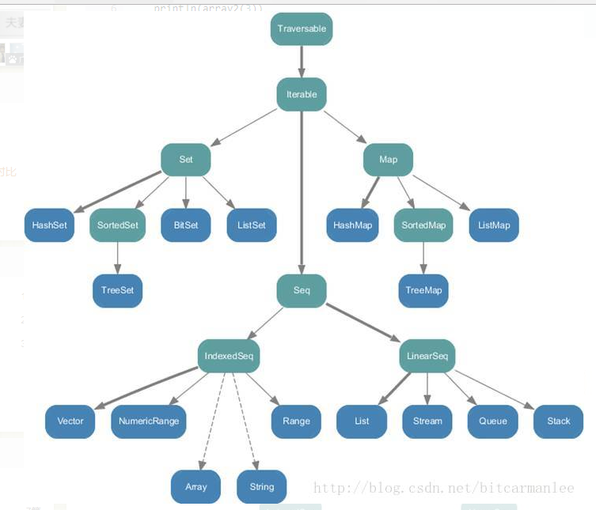

### =>

1. 表示函数的类型(Function Type)

例如：

函数double的类型就是 (x: Int) => Int 或者 Int => Int
备注： 当函数只有一个参数的时候，函数类型里面括起来函数参数的括号是可以省略的。
使用函数的类型，就可以定义函数变量(Function Value/Function Variable)
那么现在定义一个函数变量:
var x : (Int) => Int = double

2. 匿名函数(Anonymous functions/Function Literals/Lambda)

例如：通过匿名函数定义一个函数变量xx
var xx = (x: Int) => x + 1
或者，给一个高阶函数，传递一个函数：
val newList = List(1,2,3).map { (x: Int) => x * 2 }

#### ->

var a:Map[String,Int]=Map("k1"->1,"k2"->2)//初始化构造函数

​    a += ("k3"->3)//添加元素

​    a += ("k4"->4)//添加元素

​    a += ("k1"->100)//已经存在添加元素会覆盖

### Scala集合结构

根据图以及源码可以很清晰地看出scala中的集合类可以分为三大类： 
1.Seq，是一组有序的元素。 
2.Set，是一组没有重复元素的集合。 
3.Map，是一组k-v对。